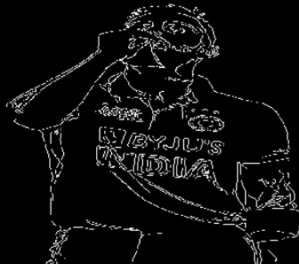
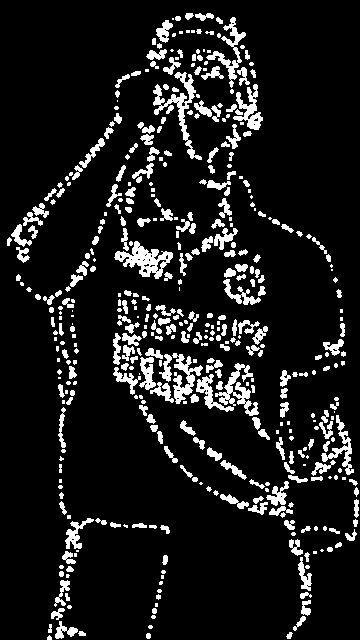
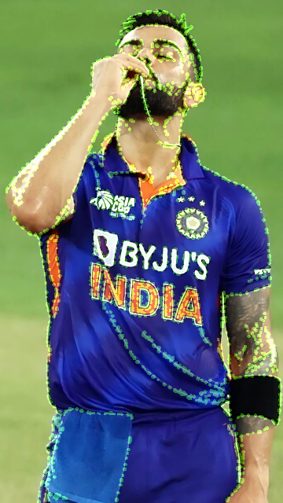

<div align="center">

# 🐜 Edge Detection with ACO

**Real-time and static image edge detection powered by Ant Colony Optimization**

*Biologically-inspired computer vision — swarm intelligence meets image processing*

[](https://python.org)
[](https://opencv.org)
[](https://numba.pydata.org)
[](LICENSE)

</div>

---

## What Is This?

Classical edge detectors (Canny, Sobel) apply deterministic filters. This project replaces the filter with a **colony of virtual ants** that walk across the image, following edge gradients and leaving pheromone trails. Over many iterations, the collective pheromone map converges into a clean, noise-resilient edge image.

The result is an edge map that emerges from **collective behaviour** rather than hand-tuned thresholds — and it adapts in real time as the scene changes.

---

## Project Structure

```
EDGE_DETECTION_WITH_ACO/
├── images/                     # Sample input images for testing
├── venv/                       # Python virtual environment
├── .gitignore
├── implement_aco_images.py     # Static image processing (single file or folder)
└── implement_aco_web.py        # Real-time webcam processing
```

---

## How It Works

Each frame (or image iteration) runs the following pipeline:

```
Input (webcam frame / image)
        │
        ▼
  Grayscale + Gaussian Blur
        │
        ├──────────────────────┐
        ▼                      ▼
  Canny edge map          Sobel gradient magnitude
  [0, 1] normalized       [0, 1] normalized
        │                      │
        └──────────┬───────────┘
                   ▼
         Heuristic = edges + grad
                   │
                   ▼
     ┌─────────────────────────────┐
     │  For each ant (parallel):   │
     │  1. Start at an edge pixel  │
     │  2. Score 8 neighbours:     │
     │     score = pher^α × η^β    │
     │  3. Roulette-wheel select   │
     │  4. Step → deposit pheromone│
     │  (repeated n_steps times)   │
     └─────────────────────────────┘
                   │
                   ▼
     pheromone += delta
     pheromone *= (1 − evaporation)
                   │
                   ▼
     Blur → Normalize → Threshold
                   │
                   ▼
           Final edge map
```

### The ACO Score Formula

For each candidate neighbouring pixel *i*:

```
score(i) = τ(i)^α  ×  η(i)^β
```

| Symbol | Meaning |
|--------|---------|
| τ(i) | Pheromone intensity at pixel *i* — collective memory |
| η(i) | Heuristic = `edges[i] + grad[i]` — edge + gradient signal |
| α | Pheromone weight (default 1.0) |
| β | Heuristic weight (default 3.0) — kept higher so ants prefer real edges |

Selection probability:

```
P(i) = score(i) / Σ score(j)
```

---

## Key Features

- **Numba JIT + parallel ants** — ~50–80× faster than pure Python; typical runtime ~0.6 ms per frame at 120×160 px
- **Live trackbars** — adjust all parameters in real time without restarting
- **Adaptive pheromone reset** — detects sudden scene changes (webcam) and decays the map quickly to catch up
- **Overflow protection** — pheromone values are clamped to prevent runaway accumulation over long sessions
- **Folder batch mode** — process an entire directory of images with arrow-key navigation
- **Overlay window** — edges rendered in colour on top of the original image
- **Screenshot / save** — single keypress saves all output windows to disk

---

## Installation

```bash
# Clone the repository
git clone https://github.com/your-username/EDGE_DETECTION_WITH_ACO.git
cd EDGE_DETECTION_WITH_ACO

# Create and activate virtual environment
python -m venv venv
source venv/bin/activate        # Windows: venv\Scripts\activate

# Install dependencies
pip install opencv-python numpy numba
```

**Requirements:** Python 3.8+, a working webcam (for `implement_aco_web.py`)

---

## Usage

### Webcam — real-time

```bash
python implement_aco_web.py
```

Three windows open simultaneously:

| Window | Content |
|--------|---------|
| `Original` | Live webcam feed with parameter overlay |
| `Canny (baslangic)` | Initial Canny edge map used as ant seed |
| `ACO Kenar Haritasi` | Final pheromone-derived edge map |

**Keyboard shortcuts:**

| Key | Action |
|-----|--------|
| `q` | Quit |
| `r` | Reset pheromone map to zero |
| `s` | Save screenshots to `screenshots/` |

---

### Static images

```bash
# Single image
python implement_aco_images.py images/sample.jpg

# Entire folder
python implement_aco_images.py images/

# Interactive file picker (no argument)
python implement_aco_images.py
```

Five windows open:

| Window | Content |
|--------|---------|
| `Original` | Source image with iteration status overlay |
| `Canny (baslangic)` | Initial Canny edge map |
| `ACO Kenar Haritasi` | Pheromone edge map (binary) |
| `Kenar Ustu (overlay)` | Green edges composited on top of original |

**Keyboard shortcuts:**

| Key | Action |
|-----|--------|
| `q` | Quit |
| `r` | Reset pheromone map and restart from scratch |
| `s` | Save all windows to `aco_output/` |
| `Space` | Pause / resume iterations |
| `←` / `→` | Previous / next image (folder mode) |

---

## Trackbar Parameters

Both scripts expose the same controls via OpenCV trackbars:

| Trackbar | Range | Default | Description |
|----------|-------|---------|-------------|
| Ant count | 1 – 200 | 40 | Number of ants dispatched per frame |
| Step count | 1 – 100 | 30 | Steps each ant walks per run |
| Alpha ×10 | 1 – 50 | 10 → 1.0 | Pheromone weight in score formula |
| Beta ×10 | 1 – 100 | 30 → 3.0 | Heuristic weight in score formula |
| Evaporation ×100 | 1 – 99 | 10 → 0.10 | Fraction of pheromone lost each frame |
| Canny threshold 1 | 0 – 255 | 60 | Lower bound for Canny hysteresis |
| Canny threshold 2 | 0 – 255 | 140 | Upper bound for Canny hysteresis |
| Binary threshold | 0 – 255 | 50 | Pheromone map binarisation cutoff |
| Blur kernel | 3 – 15 | 5 | Gaussian pre-blur size (forced odd) |
| Iterations *(image only)* | 1 – 200 | 20 | Total ACO iterations to run |
| Overlay alpha ×10 *(image only)* | 0 – 10 | 6 | Opacity of edge overlay on original |

### Tuning Tips

| Goal | Adjustment |
|------|-----------|
| More fine detail | Lower Canny thresholds + higher beta |
| Smoother, cleaner edges | Higher evaporation + more ants + more steps |
| Faster convergence | Increase ant count and iteration count |
| Noisy / textured image | Increase blur kernel before running ACO |
| Real-time scene changes | Increase evaporation rate |

---

## Output Examples

> Place your own output screenshots in an `examples/` folder and update the table below.
> Run either script and press `s` to save — files go to `screenshots/` or `aco_output/`.

| Original | Canny Seed | ACO Edge Map | Overlay |
|----------|-----------|--------------|---------|
|  |  |  |  |

---

## Performance

Tested on a 120×160 px frame with 40 ants × 30 steps:

| Mode | Time per frame |
|------|---------------|
| Pure Python (baseline) | ~30–50 ms |
| Numba JIT (this version) | **~0.6 ms** |
| Speedup | ~50–80× |

Performance scales with image resolution and ant/step count. For HD resolution, reduce `n_ants` or `n_steps` via trackbars.

---

## ACO vs Classical Edge Detection

| Property | Canny | ACO (this project) |
|----------|-------|--------------------|
| Algorithm type | Deterministic | Stochastic |
| Edge continuity | High | Emergent |
| Noise robustness | Medium | High (pheromone averaging) |
| Real-time adaptability | Instant | Slightly delayed (pheromone inertia) |
| Parameter sensitivity | Low | Medium |
| Visual character | Sharp, thin lines | Soft, collective traces |

---

## References

- Y. Bi, B. Xue, P. Mesejo, S. Cagnoni, and M. Zhang, “A Survey on Evolutionary Computation for Computer Vision and Image Analysis: Past, Present, and Future Trends,” IEEE, 2020.
https://arxiv.org/pdf/2209
- OpenCV Documentation — [docs.opencv.org](https://docs.opencv.org)
- Numba Documentation — [numba.pydata.org](https://numba.pydata.org)

---

## License

MIT License — free to use, modify, and distribute.

---

<div align="center">
<sub>Built with Python · OpenCV · Numba</sub>
</div>